# 📚 Edukita Assignment Platform

Platform untuk mengelola assignment siswa

## 🚀 Fitur

- register user
- login user
- submit assignment
- list all assignment by id Student
- list all assignment was done review by teacher
- detail assignment
- manage user (only teacher)
- review assignment student (only teacher)


## 📦 Instalasi
- Masuk kedalam folder proyek frontend dan backend sesuai dengan instruksi yang berada pada masing masing branch

## Entity Relationship Diagram (ERD)
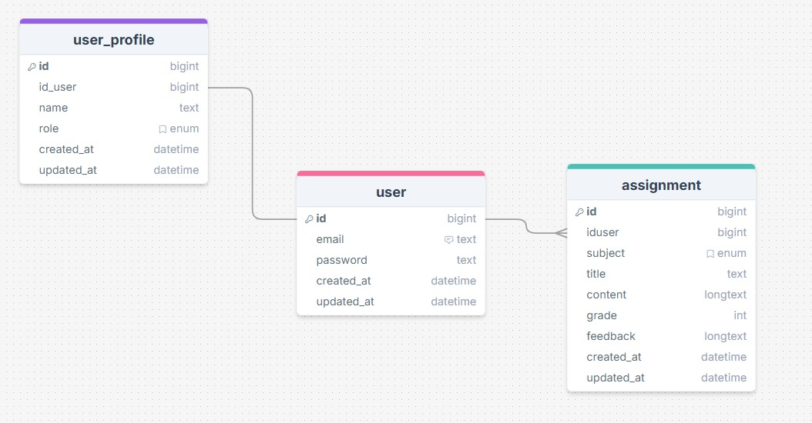
Untuk melihat detail ERD yang digunakan dalam proyek ini dapat mengunjungi link berikut ini
```bash
https://drawsql.app/teams/database-training-user/diagrams/edukita-assignment-platform
```

## Contract Data API (Application Programming Interface)
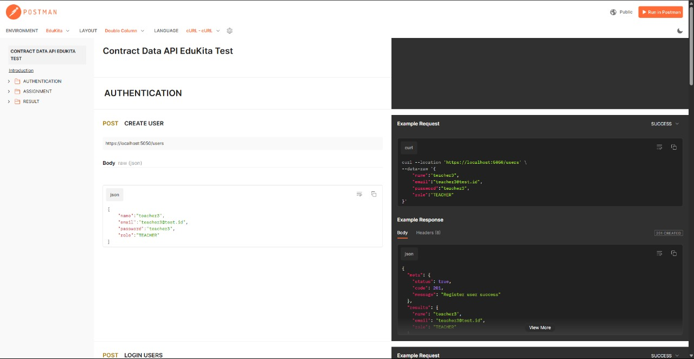
Untuk melihat detail ERD yang digunakan dalam proyek ini dapat mengunjungi link berikut ini
```bash
https://documenter.getpostman.com/view/24013047/2sB2ca7f4E
```

# Alur flow aplikasi
## User (student dan teacher) mengunjungi halaman login untuk proses autentikasi
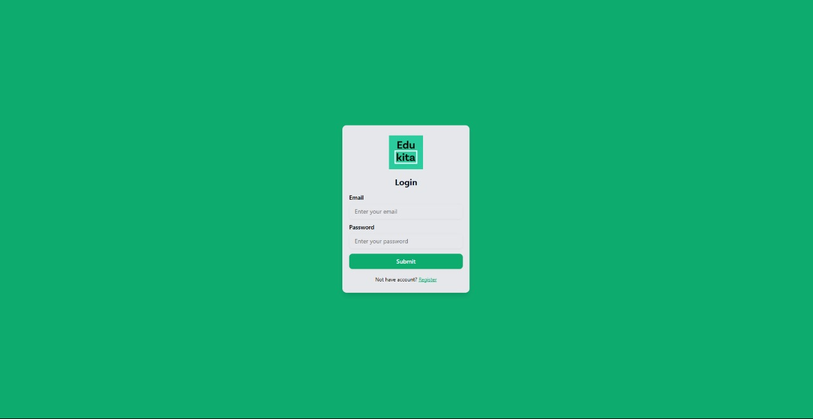
## Akun user yang akan didapatkan setelah melakukan proses seding ialah:
 1. Student

email:
```bash
test1@test.id
```
password:
```bash
test1
```
 2. Teacher
 
email:
```bash
teacher@test.id
```
password:
```bash
teacher
```
## Selain itu bisa juga mendaftar akun khusus untuk role STUDENT pada halaman
```bash
/auth/register
```
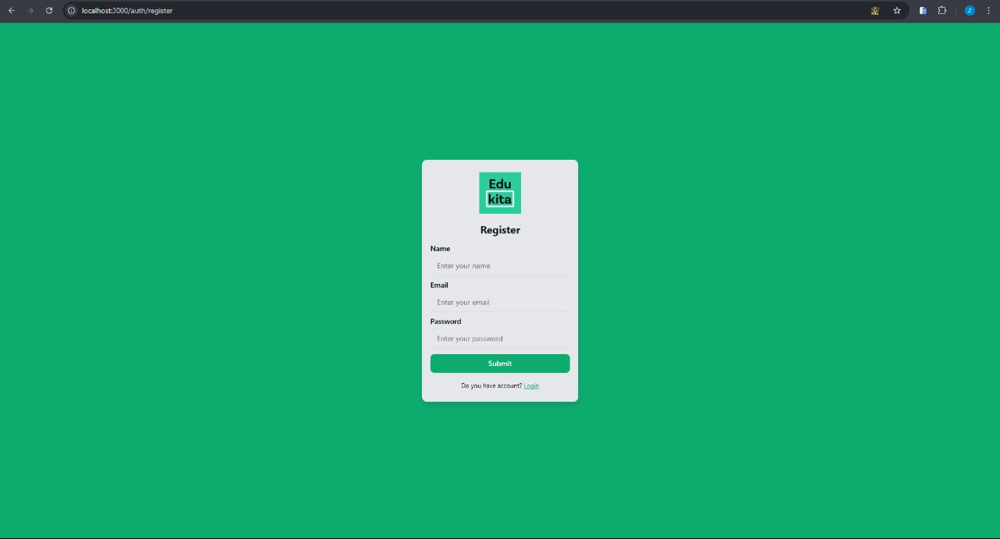
## Apabila proses autentikasi (login) sudah selesai, maka user akan di arahkan ke halaman dashboard sesuai dengan rolenya masing-masing
-Dashboard Siswa

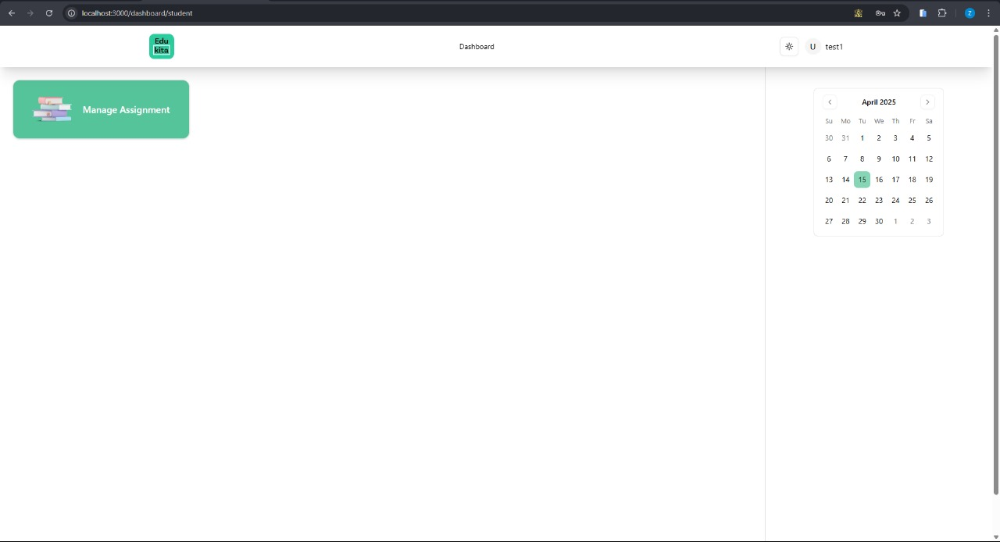

-Dashboard Guru

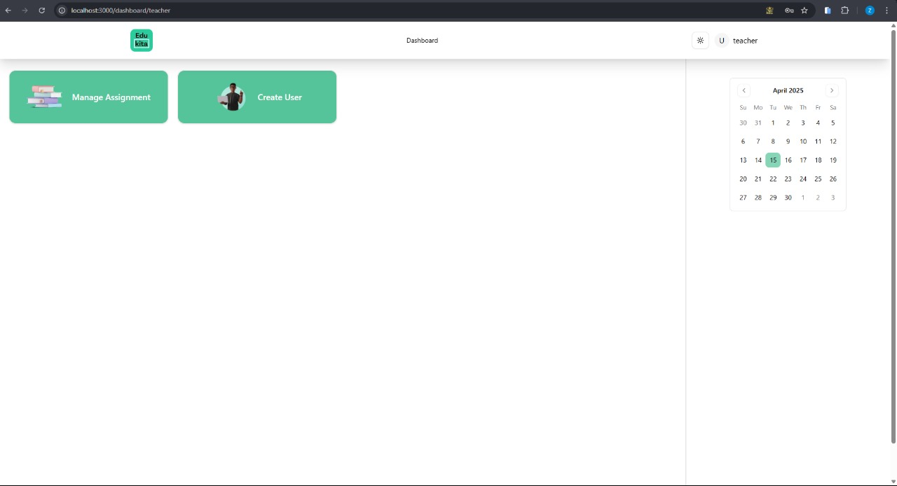

# Dashboard Siswa
## 1. Pada halaman dashboard siswa, siswa dapat klik menu Manage Assignment untuk mmelihat list assignment yang sudah di submit serta mengirimkan assignment baru

## 2. Pada halaman dashboard siswa, siswa dapat klik tab menu graded untuk melihat list assignment yang sudah dinilai
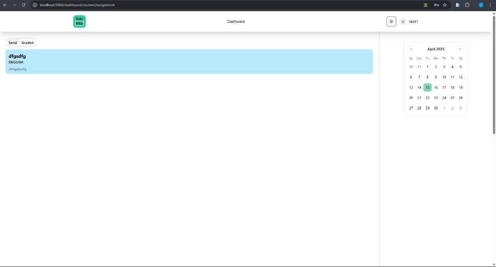
## 3. Untuk membuat sebuah assignment baru, siswa dapat klik tab menu send dan disana terdapat button yang akan membuka sebuah modal form untuk pembuatan assignment baru
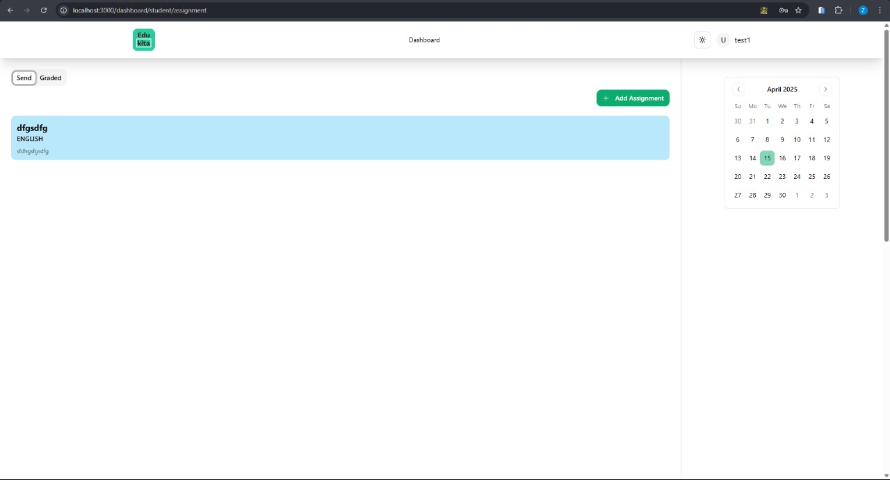
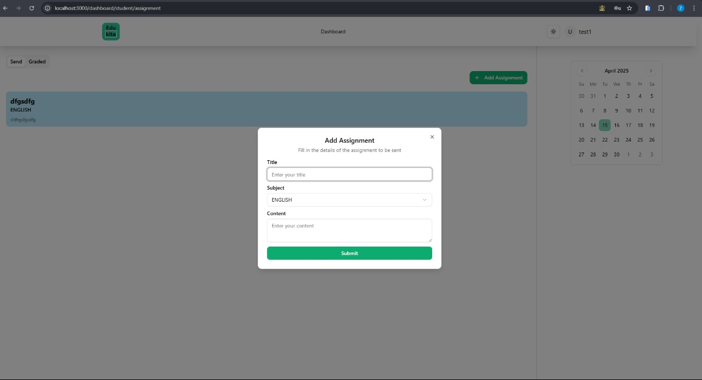

# Dashboard Guru
## 1. Pada halaman dashboard guru, guru dapat klik menu Manage Assignment untuk mmelihat list assignment yang baru saja dikirimkan

## 2. Pada halaman dashboard guru, guru dapat klik tab menu English maupun Matemathic untuk melakukan filtering data list assignment berdasarkan subject
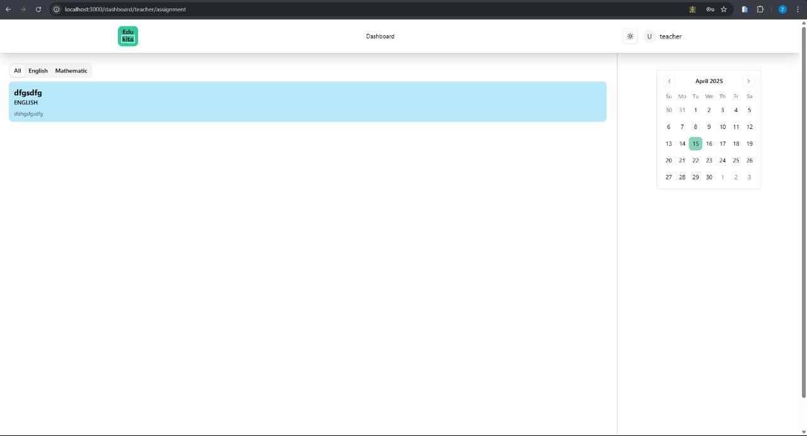
## 3. Untuk membuat sebuah baru, guru dapat menuju halaman dashboar guru dan klik menu Create User. Pada halaman tersebut guru dapat membuat user baik itu dengan jenis role STUDENT maupun TEACHER
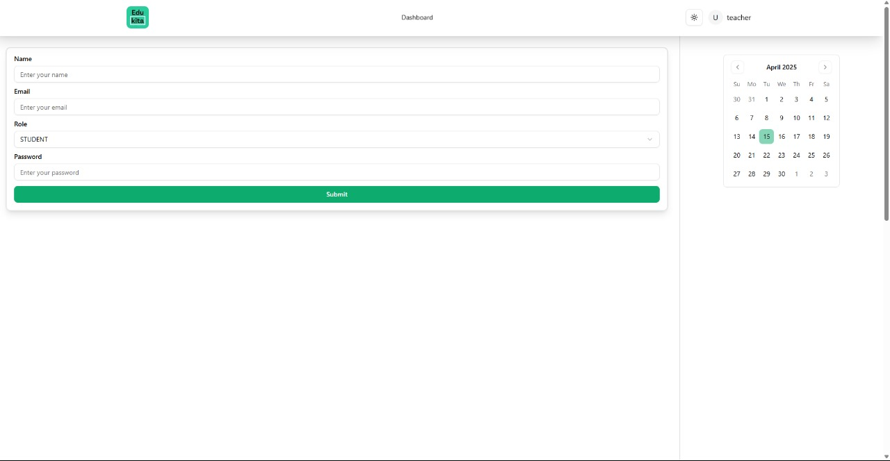
